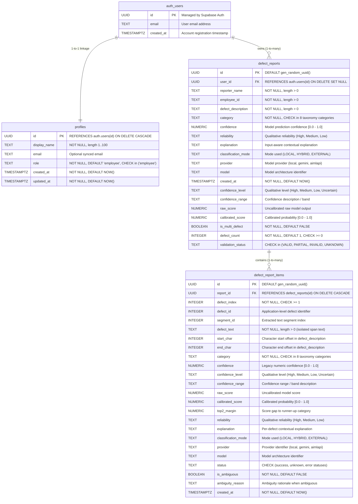

# Entity-Relationship Diagram (ERD): Industrial Defect Classifier Backend

## 1. Relational Model Overview

The backend uses a 1-to-many relational entity design centered on the parent `defect_reports` audit table and the child `defect_report_items` breakdown table in the PostgreSQL `public` schema.



## 2. Table Specifications

### Parent Table: `public.defect_reports`
```text
┌────────────────────────────────────────────────────────────────────────┐
│                             defect_reports                             │
├────────────────────────────────────────────────────────────────────────┤
│ PK id                  : UUID (DEFAULT gen_random_uuid())              │
│ FK user_id             : UUID (REFERENCES auth.users(id) SET NULL)     │
│    reporter_name       : TEXT NOT NULL                                 │
│    employee_id         : TEXT NOT NULL                                 │
│    defect_description  : TEXT NOT NULL                                 │
│    category            : TEXT NOT NULL (CHECK chk_defect_category)     │
│    confidence          : NUMERIC                                       │
│    reliability         : TEXT                                          │
│    explanation         : TEXT                                          │
│    classification_mode : TEXT                                          │
│    provider            : TEXT                                          │
│    model               : TEXT                                          │
│    created_at          : TIMESTAMPTZ NOT NULL (DEFAULT NOW())          │
│    confidence_level    : TEXT                                          │
│    confidence_range    : TEXT                                          │
│    raw_score           : NUMERIC                                       │
│    calibrated_score    : NUMERIC                                       │
│    is_multi_defect     : BOOLEAN NOT NULL DEFAULT FALSE                │
│    defect_count        : INTEGER NOT NULL DEFAULT 1 (CHECK >= 0)       │
│    validation_status   : TEXT (CHECK VALID|PARTIAL|INVALID|UNKNOWN)    │
└────────────────────────────────────────────────────────────────────────┘
```

### Child Table: `public.defect_report_items`
```text
┌────────────────────────────────────────────────────────────────────────┐
│                          defect_report_items                           │
├────────────────────────────────────────────────────────────────────────┤
│ PK id                  : UUID (DEFAULT gen_random_uuid())              │
│ FK report_id           : UUID NOT NULL (REFERENCES defect_reports(id)  │
│                          ON DELETE CASCADE)                            │
│    defect_index        : INTEGER NOT NULL (CHECK defect_index >= 1)    │
│    defect_id           : INTEGER                                       │
│    segment_id          : INTEGER                                       │
│    defect_text         : TEXT NOT NULL                                 │
│    start_char          : INTEGER                                       │
│    end_char            : INTEGER                                       │
│    category            : TEXT NOT NULL (CHECK chk_defect_item_category)│
│    confidence          : NUMERIC (CHECK 0.0 <= confidence <= 1.0)      │
│    confidence_level    : TEXT                                          │
│    confidence_range    : TEXT                                          │
│    raw_score           : NUMERIC                                       │
│    calibrated_score    : NUMERIC (CHECK 0.0 <= score <= 1.0)           │
│    top2_margin         : NUMERIC                                       │
│    reliability         : TEXT                                          │
│    explanation         : TEXT                                          │
│    classification_mode : TEXT                                          │
│    provider            : TEXT                                          │
│    model               : TEXT                                          │
│    status              : TEXT (CHECK status in approved list)          │
│    is_ambiguous        : BOOLEAN NOT NULL DEFAULT FALSE                │
│    ambiguity_reason    : TEXT                                          │
│    created_at          : TIMESTAMPTZ NOT NULL (DEFAULT NOW())          │
│    UNIQUE CONSTRAINT   : (report_id, defect_index)                     │
└────────────────────────────────────────────────────────────────────────┘
```

## 3. Data Integrity & Validation Constraints

1. **Primary & Foreign Keys**:
   - `defect_reports.id`: Globally unique server-side UUID primary key.
   - `defect_report_items.id`: Globally unique server-side UUID primary key.
   - `defect_report_items.report_id`: Mandatory foreign key referencing `public.defect_reports(id)` with `ON DELETE CASCADE` to prevent orphaned child records.
2. **Category Taxonomy Enforcement**:
   Both tables enforce the exact 8 canonical classes via CHECK constraints (`chk_defect_category`, `chk_defect_item_category`):
   - `Mechanical Fault`
   - `Electrical Fault`
   - `Sensor Fault`
   - `Temperature Fault`
   - `Software Fault`
   - `Power Supply Fault`
   - `Communication Fault`
   - `Unknown`
3. **Defect Item Ordering & Uniqueness**:
   - `defect_index`: 1-based integer ordering (`CHECK (defect_index >= 1)`).
   - `UNIQUE(report_id, defect_index)`: Guarantees deterministic, non-colliding order of child defects within any parent report. Multiple items can share the same category without restriction.
4. **Source Span Integrity**:
   - Character boundary integrity enforced by `chk_defect_item_spans`: `start_char >= 0`, `end_char >= 0`, and `end_char > start_char` when offsets are provided.
5. **Confidence & Score Bounds**:
   - `confidence` and `calibrated_score` checked to fall within `[0.0, 1.0]`.
6. **Authoritative Timestamps**:
   - Generated by PostgreSQL `NOW()` upon insertion, preventing reliance on client system clocks.

## 4. Performance Indexes

### Parent Table: `public.defect_reports`
- `idx_defect_reports_created_at`: `B-tree (created_at DESC)` for chronological history listing.
- `idx_defect_reports_user_id`: `B-tree (user_id)` for authenticated user report ownership filtering.
- `idx_defect_reports_employee_id`: `B-tree (employee_id)` for operator/technician filtering.
- `idx_defect_reports_category`: `B-tree (category)` for category filtering and aggregation.
- `idx_defect_reports_confidence_level`: `B-tree (confidence_level)` for calibration analytics.
- `idx_defect_reports_is_multi_defect`: `B-tree (is_multi_defect)` for multi-defect reporting queries.

### Child Table: `public.defect_report_items`
- `idx_defect_report_items_report_id`: `B-tree (report_id)` for high-speed foreign key lookups and parent-child joins.
- `idx_defect_report_items_report_defect_index`: `B-tree (report_id, defect_index)` for ordered child defect retrieval.
- `idx_defect_report_items_created_at`: `B-tree (created_at DESC)` for chronological querying of individual defect items.
- `idx_defect_report_items_category`: `B-tree (category)` for defect breakdown analytics across sub-faults.

## 5. Security & Access Control (Row Level Security)

- **RLS Status**: Enabled on `profiles`, `defect_reports`, and `defect_report_items`.
- **profiles**:
  - `SELECT`, `INSERT`, `UPDATE` granted strictly `TO authenticated` where `(SELECT auth.uid()) = id`.
  - `role` immutability enforced by `BEFORE UPDATE` database trigger `trg_protect_profile_role`.
- **defect_reports**:
  - `INSERT`: Restricted `TO authenticated` where `user_id = (SELECT auth.uid())`.
  - `SELECT`: Restricted `TO authenticated` where `user_id = (SELECT auth.uid())`.
  - `UPDATE` & `DELETE`: Blocked for application roles to maintain an immutable audit log.
  - Anonymous users: Zero access.
- **defect_report_items**:
  - Inherits ownership security strictly from parent `defect_reports`:
    - `SELECT`: Restricted `TO authenticated` where parent report has `dr.user_id = (SELECT auth.uid())`.
    - `INSERT`: Restricted `TO authenticated` where parent report has `dr.user_id = (SELECT auth.uid())`.
  - `UPDATE` & `DELETE`: Blocked.
  - Anonymous users: Zero access.
